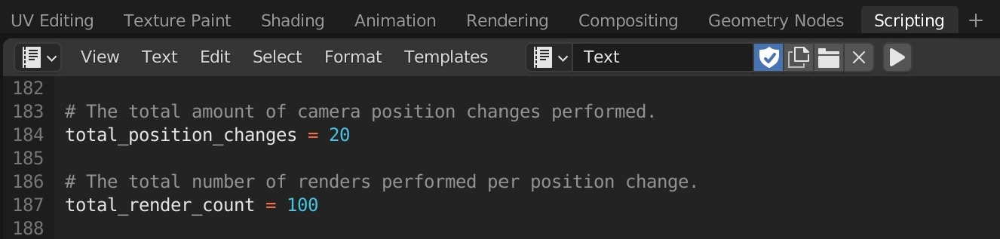
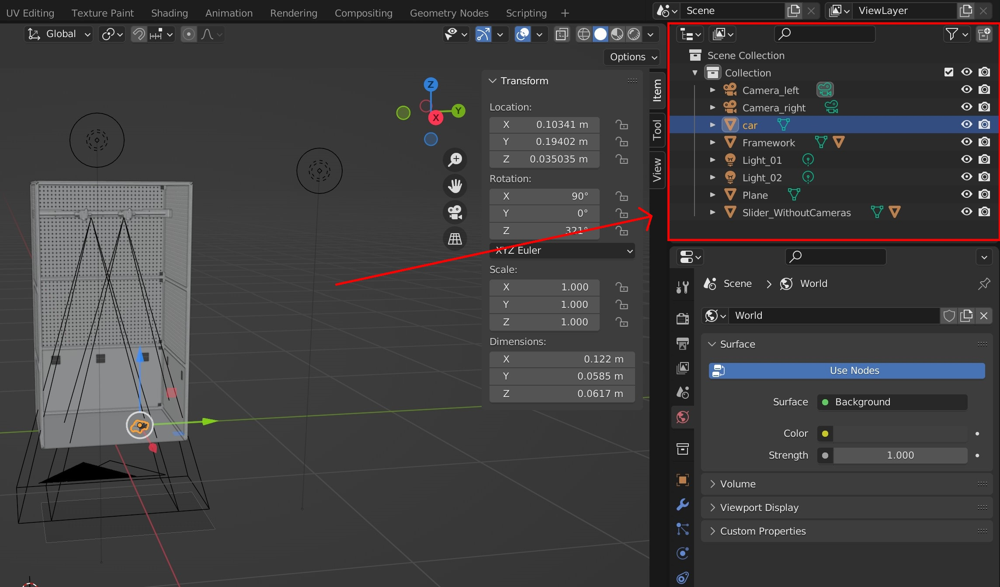

# Bachelor Thesis
By Nic Grogg

This thesis is a complete pipeline from creating a hardware setup to detecting object with this setup. The main goal here was to...

## CAD

In the subfolder of the CAD there are ...

## Blender

In this folder there are the files for the creation of artificial images to train our neural network. When the pipeline for this thesis was set out, the decision was made to try to detect a toy car that was previously used for another thesis at the pd|z lab. Thus the object to detect and make artificial images of is this toy car.

### Requirements

This project was done with Blender version 3.1.2. No additional packages are needed for the Blender Python script, it should run as is.

### Creating Artificial Images:

As mentioned before the object I am trying to detect is a small toy car. Since the car was previously used in another Thesis at the pd|z lab there existed a 3D scan and a blender compatible object file of it which is stored in the Blender -> Objects -> Car sub folder. For the surrounding scene, the framework created in NX12, described in the [CAD section](#cad), is used.

To make artificial images of the car in this scene, open the blender file "CameraSetup.blend" and go to the Scripting tab at the top:  This will open the python script in Blender where the amount of random camera position changes and the amount of images rendered for each position can be set with the "total_position_changes" and "total_render_count" variables:  After setting the desired values, the script can be executed and the images for each object will be created and saved to the data/Blender/images folder. Further, the Blender python script outputs labels for each image as text files, which are saved in the data/Blender/labels folder. These text files are formatted so that the [yolov5 neural network](https://github.com/ultralytics/yolov5) can be trained on them. A text file contains the class of the object, the x and y coordinates of the center, the width and the height of the bounding box. In addition to these text files an additional text file which contains the possible classes is in the data/Blender/labels folder in order to properly train the [yolov5 neural network](https://github.com/ultralytics/yolov5). To visualize the bounding box, the "DrawBoundingBox.py" script is provided.

### Changing Objects:

If you want to create images for different objects, here's how to properly import them into the Blender scene and modify the Blender script:

1. First you need to create or download the new object as a Blender file or Blender compatible file.
2. After the first step, open the Blender "CameraSetup.blend" file.
3. Before importing the new object the old object, that was previously used for the detection, has to be deleted. You can see all objects currently present in your Blender scene in the top right corner in the "View Layer" window:  In this example this would be the car object. Right click on the object and delete it.
4. There are two ways to add an object to the Blender file. a) You have saved the object as a Blender compatible file, but not as a Blender file itself, or b) You want to extract the object from another Blender file.
   - a) Go to File -> import -> "filetype" and select the object file you want to import.
   - b) Go to File -> append -> "open the blender file" -> Object -> select the file you want to import.
5. Sometimes the imported objects consist of several parts. For the script to work properly, the parts must be combined into one object. To do this, go to the Layout tab at the top and select each part with Shift + left click. After selecting all the parts of the object, press ctrl + j and they will be joined into one object.
6. Now before running the script you need to change one thing in the Blender script. After adding the new object you see the name of the new object in the View Layer window mentioned before. In the script there is a section where the object to detect is loaded in. In this section change the name of the object of "bpy.data.objects('object_name')" to the name you see in the View Layer window:  If you run the script now, the images for the new object will be automatically rendered.

### Additional Information

There are a few more functions implemented in the Blender file script. Since the script is well commented, I invite you to read through the script carefully and it should be self-explanatory what each part of the script does. At the moment any movement of the object and the cameras is randomized so that the object is always seen by the camera, this randomization can easily be changed if you want specific positions of the object or the cameras. In each rotation/translation function there is a random_rot/random_trans variable at the end that you can set to the desired values and then the object (or cameras) will always be moved/rotated in the specified way. Additionally and finally, if you want to set the light intensity, change the variable "light_01.data.energy" and "light_02.data.energy" in the script to the desired value.

## Train the Yolov5 Network

There is a Jupyter Notebook provided called "yolov5_ultralytics.ipynb" where all the steps to train and test the fastest yolov5 model, called yolov5s, are implemented. To see how to properly train the yolov5 neural network go to the official yolov5 [Git repository](https://github.com/ultralytics/yolov5) from Ultralytics .

## Calibrating the Cameras

...

## Object Detection and Depth Estimation

...
