# Bachelor Thesis

This GitHub repository complements the bachelor thesis of Nic Grogg. It contains the software part for building a stereo camera setup for object tracking. Below are step-by-step instructions for each subfolder on how to implement the provided scripts, and ways to customize the scripts for your own use if possible.

## Setup

### Hikorobotics Software

For the cameras at the pd|z lab it is necessary to download the official software in order for everything to work properly. Download the "Machine Vision Software MVS3.4.1" software from the [official Hikrobotics website](https://www.hikrobotics.com/en/machinevision/service/download?module=0) and install their application.

### Anaconda environment

To run the Python scripts and Jupyter Notebooks, there is a yaml file for setting up a conda environment called "BachelorThesis.yml" which should meet all the requirements.

If the install of the environment with the "BachelorThesis.yml" file yields some problems here is a step by step guide to setup an anaconda environment with all the requirements on windows:

1. Download and install anaconda
2. Open the Anaconda Prompt
3. Create a new environment with python version 3.9:
```
conda create -n myenv python==3.9
```
4. Download jupyter notebook for this environment with 2 commands:
```
conda activate myenv
conda install jupyter notebook
```
5. Start the yolov5 jupyter notebook "yolov5_ultralytics.ipynb" provided in this repository in the "yolov5_network" folder. For this open jupyter notebook with the following command in the Anaconda Prompt, which should start jupyter notebook in a webbrowser, where the "yolov5_ultralytics.ipynb" notebook can be opened:
```
jupyter notebook
```
6. Run the "Install Requirements and Clone the Ultralytics yolov5 Respository" section to install pytorch, clone the yolov5 repository and install the requirements of the yolov5 repository.
7. Close the notebook (ctrl + c in the Anaconda Prompt) and install opencv through the Anaconda Prompt:
```
pip install opencv-contrib-python
```

This should fulfill all the necessary requirements of all the subfolders of this Git repository.

# TODO
changing Cameras in Blender (maybe create function)
edit images
describe dimensions of charuco/chessboard

## Blender

The Blender subfolder contains the files for creating artificial images to train our neural network. When creating the pipeline for this thesis, it was decided to detect a toy car that had already been used for another thesis in the pd|z lab. Thus, the object to be recognized and of which artificial images are to be created is this toy car.

### Requirements

This project was implemented with Blender version 3.1.2. No additional packages are needed for the Blender Python script, it should run as is.

### Creating Artificial Images:

As mentioned before, the object to be recognized is a small toy car. Since the car was already used in another master thesis in the pd|z lab, a 3D scan and a blender-compatible object file already existed of it, which is stored in the Blender/Objects/Car subfolder. For the environment scene in the "CameraSetup.blend" file, a framework is used that was created in NX12 and is stored in the Blender/Objects/Setup subfolder.

To make artificial images of the car in this scene, open the Blender file "CameraSetup.blend" and go to the scripting tab at the top: 

This will open the python script in Blender. Make sure that before you change anything, that the "output_path" variable is set to the "data" folder of this Git repository on your computer. 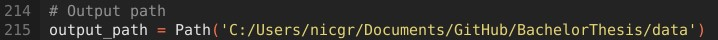

In the scripting section the amount of random camera position changes and the amount of images rendered for each position can be set with the "total_position_changes" and "total_render_count" variables: 

With each new change in the position of the camera slider, the lighting is also adjusted randomly, which provides greater robustness to lighting differences in the real world. After setting the desired values and the output path, the script can be executed and the images for each object will be created and saved in the data/Blender/images folder.

Further, the Blender python script outputs labels for each image as text files, which are saved in the data/Blender/labels folder. These text files are formatted so that the [yolov5 neural network](https://github.com/ultralytics/yolov5) can be trained on them. A text file contains the class of the object, the x and y coordinates of the center, the width and the height of the bounding box. In addition to these text files an additional text file which contains the possible classes is in the data/Blender/labels folder in order to properly train the [yolov5 neural network](https://github.com/ultralytics/yolov5). To visualize the bounding box, the "DrawBoundingBox.py" script is provided.

### Changing Objects:

To create images for new different objects, here's how to properly import them into the Blender scene and modify the Blender script:

1. First you need to create or download the new object as a Blender file or Blender compatible file.
2. After the first step, open the Blender "CameraSetup.blend" file.
3. Before importing the new object the old object, that was previously used for the detection, has to be deleted. In this example this would be the car object. Right click on the object name in the "View Layer" window and delete it. You can see all objects currently present in your Blender scene in the top right corner in the "View Layer" window: 
4. There are two ways to add an object to the Blender file. a) You have saved the object as a Blender compatible file, but not as a Blender file itself, or b) You want to extract the object from another Blender file.
   - a) Go to File -> import -> "filetype" and select the object file you want to import.
   - b) Go to File -> append -> "open the blender file of the new object" -> Object -> select the file you want to import.
5. Sometimes the imported objects consist of several parts. For the script to work properly, the parts must be combined into one object. To do this, go to the Layout tab at the top and select each part with Shift + left click. After selecting all the parts of the object, press ctrl + j and they will be joined into one object.
6. Now before running the script you need to change one thing in the Blender script. After adding the new object you see the name of the new object in the View Layer window mentioned before. In the script there is a section where the object to detect is loaded in. In this section change the name of the object of "bpy.data.objects('object_name')" to the name you see in the View Layer window: 

If you run the script now, the images for the new object will be automatically rendered.

### Additional Information

There are a few more functions implemented in the Blender "CameraSetup.blend" file script. Since the script is well commented, I invite you to read through the script carefully and it should be self-explanatory what each part of the script does.

At the moment any movement of the object and cameras is randomized so that the object is always seen by the camera, this randomization can easily be changed if you want specific positions of the object or cameras. In each rotation/translation function, there is a "random_rot"/"random_trans" variable at the end that you can set to the desired values, and then the object (or cameras) will always be moved/rotated in the specified way. An example where the "random_rot" could be modified in the blender script is in the object rotation function:


To replicate previous camera setups, there is a function called "set_camera_extrinsics" uncomment this function:
 and then comment out the "randomly_translate_slider" function to set a specific camera position:
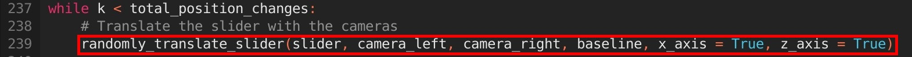 The "set_camera_extrinsics" function takes the real world position given by the baseline of the cameras and the holes where the slider is mounted, and replicates the position of the cameras and slider in Blender. The coordinate system of the holes has the origin in the upper right corner of the right side wall of the framework, with the x axis pointing to the left and the z axis pointing down. In order for the real world scenario to be replicated appropriately, make sure that the baseline of the cameras in the real world is centered on the slider.

If you want to additionally adjust the light intensity, change the variables "light_01.data.energy" and "light_02.data.energy" in the script to the desired value: 

## Yolov5 Network

In this folder there is a Jupyter Notebook provided called "yolov5_ultralytics.ipynb" where all the steps to train and test one of the fastest yolov5 models, called yolov5s, are implemented. To see how to properly train a yolov5 neural network go to the official [yolov5 Git repository from Ultralytics](https://github.com/ultralytics/yolov5).

### Requirements
In this notebook to train the network it is not necessary to set up the provided environment described in the [Setup section](#setup) as all the dependencies should be installed in the notebook.

### Train the Network with the yolov5_ultralytics Notebook

Here is a small introduction on how to train and test the yolov5s neural network on the previously rendered artificial images of the toy car from the [Blender section](#blender).

1. First in the notebook in the "Install Requirements and Clone the Ultralytics yolov5 Respository" section the [yolov5 Git repository from Ultralytics](https://github.com/ultralytics/yolov5) is cloned and the required libraries are installed.
2. After the environment has been cloned make sure to put the here provided "yolo_dataset.yaml" file (and "runs" folder if you want to test it on the toy car) into the cloned yolov5 Git folder on your pc.
3. To Train your model run the "Train Model" section of the notebook, for explanation of the added flags see the [yolov5 Git repository from Ultralytics](https://github.com/ultralytics/yolov5). This will train the yolov5s model and save the model to the yolov5/runs/train folder.
4. To test the trained model run the "Load Model" section of the notebook. This will load the trained weights and visualize the prediction of one of the artificial images of the toy car from the [Blender section](#blender).

## Calibrating the Cameras

In the "Calibration" folder there are python scripts for calibrating the Camera Setup. A step by step guide on how to use the scripts to calibrate your cameras is provided here. To take and save videos or images with the cameras at the pd|z, additional software is required. This software can be downloaded from the [official Hikrobotics website](https://www.hikrobotics.com/en/machinevision/service/download?module=0). It is necessary to download the "Machine Vision Software MVS3.4.1" software and install their application.

There are two ways [a)](#step-0-save-a-video-with-both-cameras-separately-of-a-charuco-marker-board) and [b)](#b-run-the-stereo_capturepy-script-in-the-calibrationstereo_image_capturemultiplecameras-folder) to create the frames for the mono calibration. In a) the official application from Hikorobotics is used to capture a video and this video is then transformed into single frames in b) the development script provided by Hikorobotics is modified to directly take single images with both cameras.

### Step 0: Save a video with both cameras separately of a ChArUco marker board

This Step is only necessary if you want to take way a). Make sure you know the path to the location to which the application saves the video files to. This can be seen in the Settings -> Recording/Capturing -> Select Directory -> Saving Path.

1. Run the "MVS.exe" file in the downloaded folder from the [Hikrobotics website](https://www.hikrobotics.com/en/machinevision/service/download?module=0).
2. Plug in the cameras with USB and connect the cameras to the application, for this hover over their name and press the connect button:
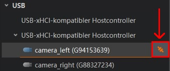
3. Rename them to camera_left and camera_right if it hasn't already been done. Make sure the left camera is also the camera with an L and the right camera the camera with an R written on it.
4. On the top left bar there is the option to go into multiple windows mode, select the 4 windows mode. Now four small windows should appear on the screen: 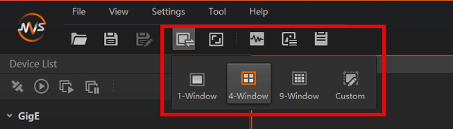
5. If not automatically done drag and drop the cameras to one window each.
6. Start grabbing the images by clicking the "Start Batch Acquisition" button on the upper left corner: 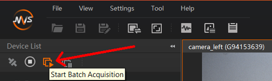 Make sure you know which camera is the left camera and which the right camera.
7. Double click on one camera and start recording by pressing the record button: 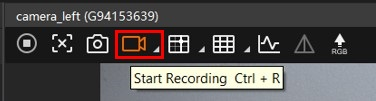 After you have stopped recording do the exact same thing with the other camera. Make sure to move and minimally rotate the ChArUco board around so that the whole image plane of the cameras have been covered at least once in the videos.

### Step 1: Making images for each camera of the ChArUco marker board

#### a) Run the "Mono_frameproduction.py" to create single image frames of the videos
1. Copy and paste the path of the location to which the videos were saved to into the script for both the left and right camera: 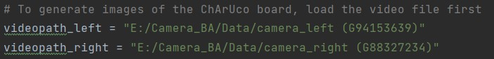 Also make sure that the "path" variable is set to the "data/Calibration" folder of this Git repository on your computer. 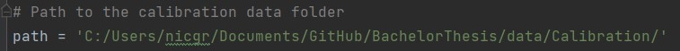 Remember that there are two cameras so you will have to run this script twice, once for the left and once for the right camera.
2. After running it once for the left camera you can run it again for the right camera. For the right camera comment out the "file_left" and "cap" variables and uncomment the "file_right" and "cap" like this: 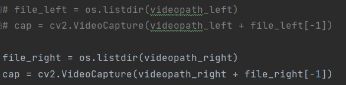 Also save the file to the "data/Calibration/frames_mono/frames_right" folder of this Git repository on your computer like this: 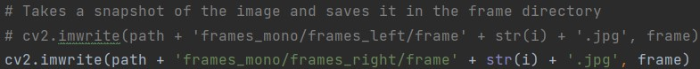

#### b) Run the "Stereo_capture.py" script in the Calibration/Stereo_Image_Capture/MultipleCameras folder
Another possible way to create the ChArUco marker images is by using the "Stereo_capture.py" script in the Calibration/Stereo_Image_Capture/MultipleCameras folder of this respository. Here is a guide on how to save the images:

1. Make sure that the the path in the "set_path_mono" function is the path on your computer to the data/Calibration/frames_mono folder of this repository: 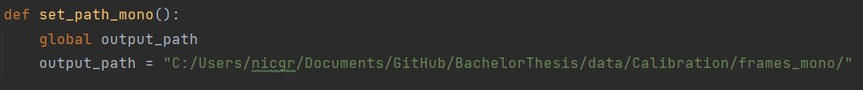
2. Plug the cameras to the computer, first the left camera then the right camera
3. Run the script and a Window should open called "Stereo Capture".
4. Initialize and Open the cameras by pressing the "Initialization Cameras" and "Open Device" buttons.
5. Check the "Continuous" box and click the "Start Grabbing" button. Now the two camera videos should appear on the right side. Make sure that the video capture of the camera which will be the left camera in the setup is also the left of the two windows. In the pd|z lab I signed the cameras with an L and R for left and right camera to remember later which camera should be on the left. If the left camera is not represented in the left window unplug both cameras and first plug in the left then the right camera.
6. Place the ChArUco board so that it is seen by both cameras: 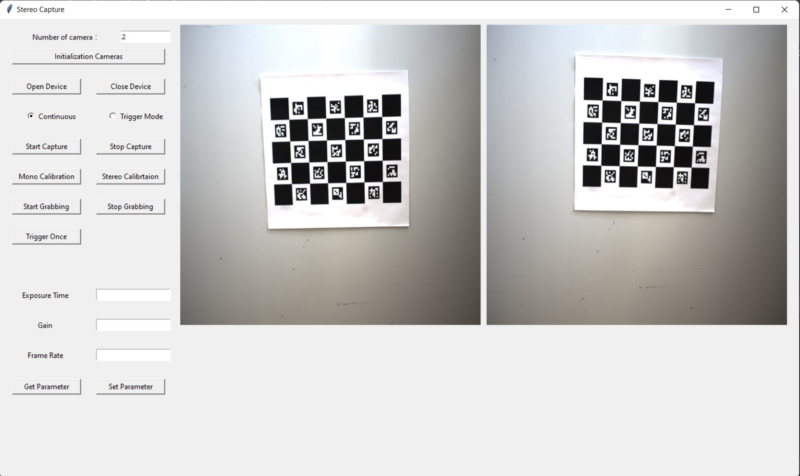
7. Press the "Stop Grabbing" button. The video capture will stop.
8. Uncheck the "Continuous" box by checking the "Trigger Mode" box.
9. Click the "Start Capture" button, then the "Mono Calibration" button and finally the "Start Grabbing" button.
10. If done correctly as described in the previous steps the ChArUco board should be visible to both cameras. Once the "Trigger Once" button is pressed a frame will be captured and displayed by both cameras. This frame will then be saved to either the "data/Calibration/frames_mono/frames_left" folder for the left camera or "data/Calibration/frames_mono/frames_right" for the right camera.

### Step 2: Run the "Mono_Calibration.py" script to get the intrinsics for both cameras.

Make sure that the "path" variable in the "Mono_Calibration.py" script is the path on your computer to the "data/Calibration" folder of this repository: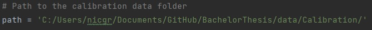 By running the script it will calibrate and save the intrinsics of both of the cameras to the "data/Calibration/Camera_intrinsics" folder.

### Step 3: Run the "Stereo_capture.py" script in the Calibration/Stereo_Image_Capture/MultipleCameras folder.

1. Make sure that the the path in the "set_path_stereo" function is the path on your computer to the data/Calibration/frames_stereo folder of this repository: 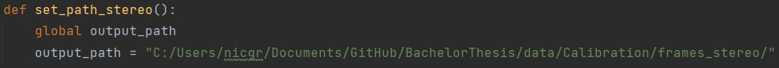
2. Follow steps 2. - 5. of the [description for the mono calibration](#b-run-the-stereo_capturepy-script-in-the-calibrationstereo_image_capturemultiplecameras-folder).
3. Place the checker board so that it is visible to both cameras.
4. Press the "Stop Grabbing" button. The video capture will stop.
5. Uncheck the "Continuous" box by checking the "Trigger Mode" box.
6. Click the "Start Capture" button, then the "Stereo Calibration" button and finally the "Start Grabbing" button.
7. If done correctly as described in the previous steps the checker board should be visible to both cameras. Once the "Trigger Once" button is pressed a frame will be captured and displayed by both cameras. This frame will then be saved to either the "data/Calibration/frames_stereo/frames_left" folder for the left camera or "data/Calibration/frames_stereo/frames_right" for the right camera.

### Step 4: Execute the "Stereo_Calibration.py" script to get the camera extrinsics

For this step, the cameras must be mounted the way they will be used later. The left camera must be on the left side when you stand in front of the framework and look into it.
Make sure that the variable "path" in the "Stereo_Calibration.py" script is the path on your computer to the "data/Calibration" folder of this repository:  Running this script calibrates and saves the extrinsics of your camera setup to the "data/Calibration/Camera_extrinsics" folder.

## Object Detection and Triangulation

Make sure that the "data_path" variable in the "Triangulation_MultipleCameras.py" script of the of the Triangulation/MultipleCameras folder is the path on your computer to the data folder of this repository: 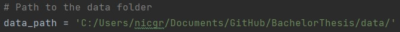 Further make sure, that you load in the right weights for the yolov5 network: 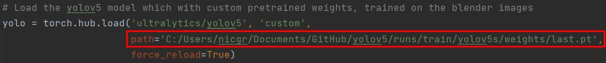 Then run the script. Two windows should pop up and if an object to detect is visible for both cameras it will detect it and calculate and print the distance of the object to the left camera.
